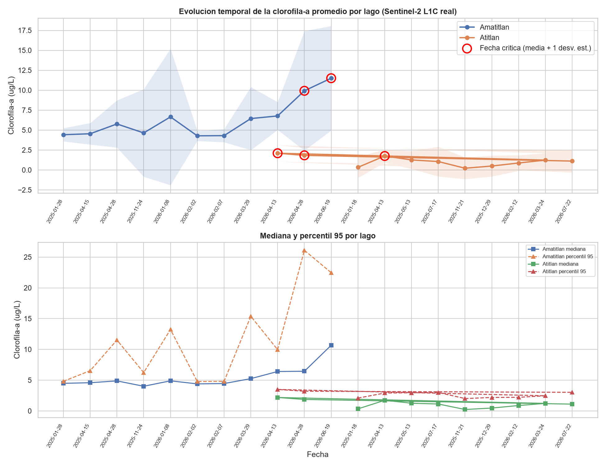
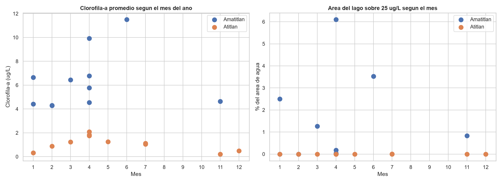
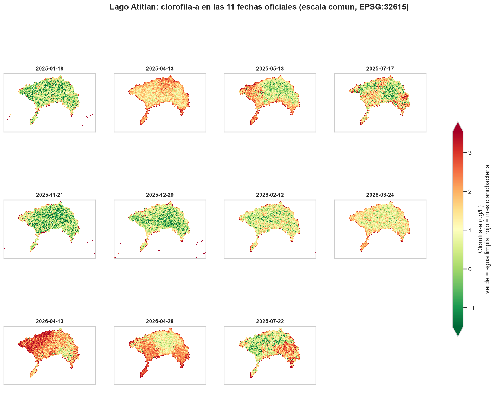
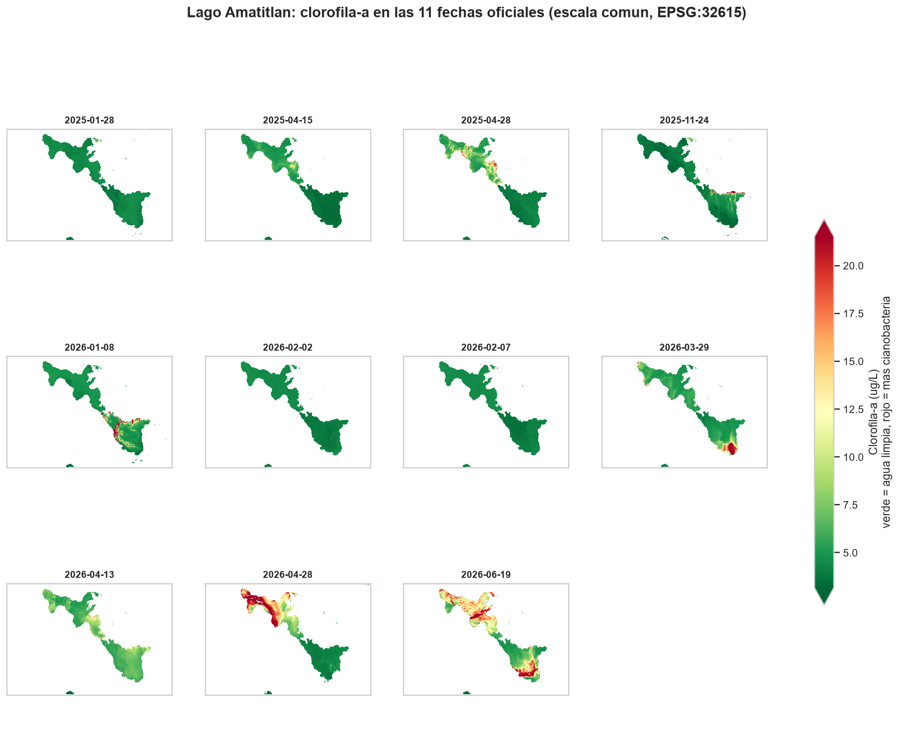
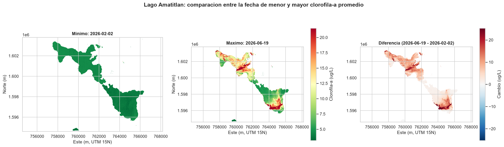
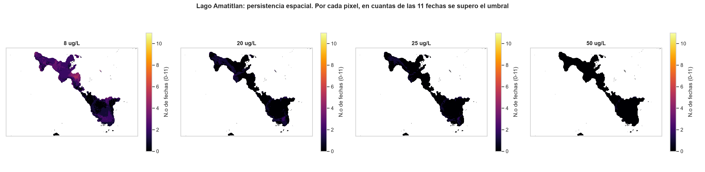
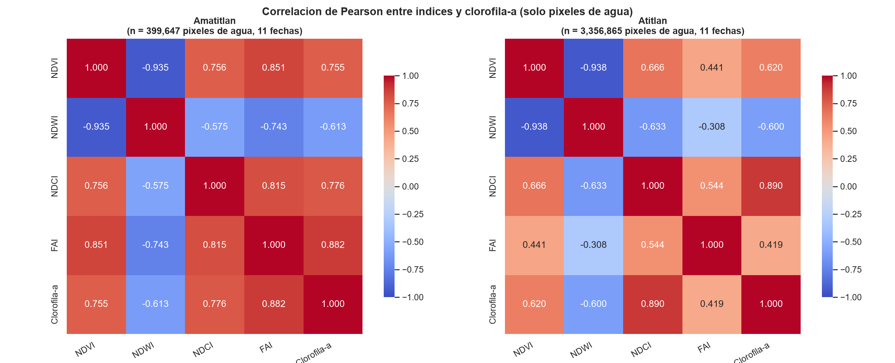
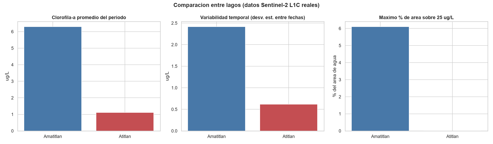

# Monitoreo Satelital de Cianobacterias
## Lago de Atitlán y Lago de Amatitlán, Guatemala

**Laboratorio 4, Parte 1 — Análisis de Datos Geoespaciales**
**Universidad del Valle de Guatemala (UVG) — CC3084 Data Science**
**Fecha:** 23 de agosto de 2026
**Datos:** 22 imágenes Sentinel-2 L1C reales (11 fechas por lago, enero 2025 – julio 2026)

---

## Nota sobre esta versión del informe

Una versión anterior de este informe se elaboró con **datos simulados**, porque en aquel
momento no se habían descargado las imágenes satelitales. Aquellas cifras no describían el
estado real de los lagos.

**Este informe reemplaza por completo aquellas cifras.** Todos los números, mapas y
gráficas provienen de **22 imágenes reales de Sentinel-2** descargadas del programa
Copernicus de la Agencia Espacial Europea. Los archivos de la versión simulada se
conservan en el repositorio únicamente como registro del desarrollo, marcados como
obsoletos.

---

## 1. ¿Qué se hizo y por qué?

Las **cianobacterias** son microorganismos que viven de forma natural en lagos y ríos.
Cuando el agua recibe demasiados nutrientes —principalmente por aguas residuales sin
tratar, fertilizantes agrícolas y escorrentía urbana— y la temperatura es alta, se
multiplican de forma explosiva. A eso se le llama **floración algal**. Sus efectos van más
allá de manchar el agua: consumen el oxígeno, pueden matar peces, algunas especies liberan
toxinas peligrosas para personas y animales, y afectan al turismo y al abastecimiento de
agua de las comunidades.

Medir esto con lanchas y muestras de laboratorio es caro y solo cubre unos pocos puntos.
Los **satélites** ofrecen una alternativa complementaria: observan todo el lago a la vez,
cada pocos días, y de forma gratuita.

Este trabajo usa el satélite **Sentinel-2**, que fotografía la Tierra en varios colores,
incluidos algunos que el ojo humano no ve. La clorofila —el pigmento verde de las algas—
refleja la luz de una manera muy característica en la zona del rojo, y eso permite
estimar cuánta hay en el agua.

### Lo que este informe puede y no puede decir

> **Importante.** Lo que se presenta son **estimaciones hechas desde el espacio**, no
> mediciones de laboratorio. En este trabajo **no se tomó ninguna muestra de agua** para
> comprobarlas. Sirven para ver **dónde y cuándo** cambia la situación, y para comparar
> zonas y fechas entre sí. No sustituyen a un análisis de laboratorio ni permiten afirmar
> que exista toxicidad, porque la clorofila mide biomasa de algas, no toxinas.

---

## 2. Cómo se obtuvieron los datos

**Origen.** Se descargaron 22 imágenes del satélite Sentinel-2 (nivel L1C) desde
Copernicus Data Space, usando las 11 fechas oficiales por lago que fijó el enunciado del
laboratorio, todas con poca nubosidad sobre el lago.

**Preparación.** De cada imagen se tomaron solo los 9 canales de color necesarios. Todas
se colocaron en un mismo sistema de coordenadas (UTM 15N) y a una misma resolución de
**20 metros por píxel**: cada píxel representa un cuadrado de 20 × 20 m, es decir
**400 m² = 0.04 hectáreas**.

**Separar agua de tierra.** Los archivos de contorno disponibles eran rectángulos, no la
forma real de la costa. Por eso el agua se identifica con un **índice de detección de agua
(WBI)** calculado desde la propia imagen. El resultado coincide bien con la realidad:

| Lago | Superficie de agua detectada | Superficie real aproximada |
|---|---|---|
| Atitlán | 122.1 km² | ~130 km² |
| Amatitlán | 14.5 km² | ~15 km² |

Esta coincidencia es una comprobación de que el método está funcionando correctamente.

**Cálculo de la clorofila.** Se usó el script oficial *Cyanobacteria Chlorophyll-a NDCI
L1C* de Sentinel Hub, el que pedía el enunciado. Para asegurar que se reprodujo bien, se
comparó el cálculo propio contra el original **píxel por píxel en 500 puntos**: la
diferencia fue **exactamente cero**.

---

## 3. Resultados

### 3.1 Cómo cambió la situación a lo largo del tiempo

**Los dos lagos están en situaciones muy distintas.**

| Indicador | Amatitlán | Atitlán |
|---|---|---|
| Clorofila-a promedio del período | 6.30 µg/L | 1.11 µg/L |
| Mediana del período | 4.88 µg/L | 1.12 µg/L |
| Variación entre fechas | 2.41 µg/L | 0.62 µg/L |
| Superficie de agua media | 14.5 km² | 122.1 km² |
| Fecha con mayor concentración | 19 jun 2026 | 13 abr 2026 |
| Fecha con menor concentración | 2 feb 2026 | 21 nov 2025 |

Amatitlán presenta concentraciones **entre cinco y seis veces mayores** que Atitlán en
promedio, y una **tendencia al alza** hacia el final del período: pasa de unos 4.4 µg/L en
enero de 2025 a 11.5 µg/L en junio de 2026.

Atitlán se mantiene en valores bajos durante todo el período (medias entre 0.22 y
2.10 µg/L), propios de un lago de aguas limpias.

**Fechas críticas** (calculadas automáticamente, no elegidas a mano; corresponden a las
fechas que superan el promedio del lago más una desviación estándar):

| Lago | Fechas críticas detectadas |
|---|---|
| Amatitlán | 28 abr 2026 y 19 jun 2026 |
| Atitlán | 13 abr 2025, 13 abr 2026 y 28 abr 2026 |

**Patrón estacional.** En ambos lagos los valores más altos se concentran entre **abril y
junio**, al final de la estación seca y comienzo de las lluvias, y los más bajos en
**noviembre y diciembre**.

> **Cautela.** Que las floraciones coincidan con ciertos meses **no demuestra** que la
> estación sea la causa. Para afirmar eso harían falta datos de nutrientes, temperatura
> del agua y caudales de los ríos que este trabajo no incluye. Los datos climáticos de
> referencia disponibles son **promedios históricos por mes**, no las condiciones del día
> concreto de cada fotografía satelital.

### 3.2 Dónde se concentra el problema dentro de cada lago

Los valores altos **no se reparten por igual**. Se concentran en las orillas y en las
zonas menos profundas, sobre todo cerca de donde desembocan los ríos, mientras que el
agua abierta y profunda se mantiene limpia.

El mapa de diferencia (derecha) muestra que el empeoramiento tampoco es uniforme: crece
sobre todo en las mismas zonas someras que ya estaban afectadas.

También se generaron **mapas interactivos navegables** (`outputs/parte1_real/maps/*.html`)
que permiten acercarse a cualquier zona del lago sobre un mapa base real. Son la
herramienta recomendada para conversar con comunidades y autoridades locales.

### 3.3 Zonas que se repiten

Estos mapas cuentan, para cada punto del lago, **en cuántas de las 11 fechas** se superó
cada nivel. Las zonas que aparecen repetidamente son las **áreas de acumulación
persistente**: son las que conviene priorizar para muestreo de campo y para medidas de
control, en lugar de repartir los recursos por igual en todo el lago.

### 3.4 Relación entre los distintos indicadores

| Relación | Atitlán | Amatitlán | Lectura |
|---|---|---|---|
| NDWI ↔ clorofila-a | −0.60 | −0.61 | Negativa: a más algas, menos señal de agua limpia |
| NDVI ↔ clorofila-a | +0.62 | +0.76 | Positiva: las manchas densas de algas se parecen a vegetación |
| NDCI ↔ clorofila-a | +0.89 | +0.78 | ⚠️ Ver advertencia |
| NDVI ↔ NDWI | −0.94 | −0.93 | La esperada; confirma que el procesamiento funciona |

> ⚠️ **La relación entre NDCI y clorofila-a no es un descubrimiento.** La clorofila se
> **calcula a partir del** NDCI mediante una fórmula. Que estén muy relacionados es una
> consecuencia matemática inevitable, no una observación sobre el lago. Presentarla como
> hallazgo ecológico sería un razonamiento circular.
>
> La única relación **realmente informativa** es la del NDWI, porque ese índice no
> interviene en el cálculo de la clorofila.

### 3.5 Comparación entre los dos lagos

**Intensidad.** Amatitlán tiene concentraciones mucho más altas de forma sostenida.

**Frecuencia y extensión.** Con el umbral de 25 µg/L, Amatitlán llega a tener hasta un
**6.10 %** de su superficie afectada en una fecha, mientras que en Atitlán el máximo es
**0.002 %**.

**Variabilidad.** Amatitlán cambia más entre fechas; su estado es menos estable.

**Posibles explicaciones** (hipótesis razonables, **no demostradas** con estos datos):

- **Profundidad y volumen.** Atitlán es un lago volcánico muy profundo; Amatitlán es
  somero. Un volumen grande diluye los nutrientes.
- **Presión urbana.** Amatitlán recibe las descargas de la cuenca del área metropolitana
  de Guatemala a través del río Villalobos. Atitlán no tiene una presión equivalente.
- **Tamaño.** Atitlán tiene más de ocho veces la superficie de Amatitlán.

---

## 4. Los cuatro niveles de alerta evaluados

Se evaluaron cuatro umbrales. **No significan lo mismo** y por eso conviene no
intercambiarlos:

| Nivel | Qué significa | Respaldo |
|---|---|---|
| **8 µg/L** | Comienzo de la condición **eutrófica**: el lago empieza a tener exceso de nutrientes | Frontera mesotrófico → eutrófico, OECD (1982) |
| **20 µg/L** | Valor usado en la primera versión de este informe. Está dentro de la banda eutrófica y del rango de Alerta 1 de la OMS (12–24) | **No es una frontera publicada por sí misma** |
| **25 µg/L** | Paso a condición **hipertrófica**: lago claramente degradado | Frontera eutrófico → hipertrófico, OECD (1982); coincide con el techo de la Alerta 1 de la OMS (24 µg/L) |
| **50 µg/L** | Escenario severo, usado como comprobación | **No aparece** como valor de clorofila en OECD 1982 ni en las guías de la OMS 2021 |

### Resultados con cada nivel

| Nivel | Área afectada total | % del agua | Amatitlán | Atitlán |
|---|---|---|---|---|
| 8 µg/L | 2,405.8 ha | 1.601 % | 14.51 % | 0.064 % |
| 20 µg/L | 393.3 ha | 0.262 % | 2.444 % | 0.0019 % |
| 25 µg/L | 207.8 ha | 0.138 % | 1.296 % | 0.0004 % |
| 50 µg/L | 24.3 ha | 0.016 % | 0.151 % | 0.0001 % |

**Recomendación.** Se propone **25 µg/L** como nivel de referencia principal, porque es el
único de los cuatro que corresponde a una **frontera publicada** por dos fuentes
independientes (OECD y OMS) y marca el paso a un estado claramente degradado. La elección
se hizo **por su significado ambiental**, no por conveniencia estadística.

Para el análisis de la Parte 2 se recomienda además usar **8 µg/L** como comprobación,
porque es el único nivel con suficiente cantidad de datos en ambos lagos.

---

## 5. Limitaciones

Estas limitaciones son importantes y deben acompañar cualquier uso de estos resultados:

1. **No hay validación en campo.** No se tomaron muestras de agua. Las cifras son
   estimaciones satelitales sin comprobación de laboratorio.

2. **El algoritmo tiene un error grande.** Su documentación reporta un error porcentual
   medio del **42.3 %** y un error cuadrático relativo del **95.8 %**. Además fue
   calibrado para una especie concreta (*Microcystis aeruginosa*) y sobre datos
   **simulados**, no sobre muestras de estos lagos.

3. **Buena parte de las estimaciones de Atitlán quedan fuera del rango calibrado.** El
   algoritmo está calibrado entre 1 y 60 µg/L. En Atitlán, el **45 %** de los píxeles cae
   por debajo de ese rango y un **16.7 %** arroja valores negativos, que no tienen sentido
   físico. La conclusión de que Atitlán tiene concentraciones bajas es sólida, pero **sus
   valores absolutos concretos no son fiables**. En Amatitlán este problema es marginal
   (0.17 %).

4. **No hay máscara de nubes por píxel.** La colección utilizada no proporciona las capas
   de detección de nubes. El único control fue elegir escenas con poca nubosidad y
   descartar píxeles espectralmente inválidos. Podrían quedar nubes o sombras residuales.

5. **Sin corrección atmosférica.** Se usó el nivel L1C, que mide la luz en lo alto de la
   atmósfera. Es lo que pide el algoritmo, pero añade incertidumbre.

6. **Solo 11 fechas por lago.** Es suficiente para ver un patrón estacional, pero no para
   afirmar una tendencia de varios años.

7. **Correlación no es causa.** Ninguna de las asociaciones descritas demuestra causalidad.

---

## 6. Conclusiones y recomendaciones

### Conclusiones

1. **Los dos lagos están en estados muy diferentes.** Amatitlán muestra concentraciones
   propias de un sistema con exceso de nutrientes; Atitlán, de un lago de aguas limpias.
2. **Amatitlán muestra una tendencia al alza** dentro del período observado, con sus
   valores más altos en abril y junio de 2026.
3. **Hay un patrón estacional claro** en ambos lagos: peor entre abril y junio, mejor en
   noviembre y diciembre.
4. **El problema es espacialmente selectivo**: se concentra en zonas someras y cercanas a
   la costa, y esas zonas se repiten entre fechas.
5. **La teledetección funciona como sistema de vigilancia**, siempre que sus resultados se
   interpreten con las limitaciones anteriores.

### Recomendaciones

- **Validar con muestras de agua.** Es la limitación más importante. Con al menos cinco
  puntos de muestreo por lago se podría ajustar el algoritmo a las condiciones locales.
- **Vigilar preventivamente entre enero y marzo**, antes del período de mayor riesgo.
- **Concentrar el esfuerzo en las zonas persistentes** que señalan los mapas, en lugar de
  repartirlo por igual.
- **Priorizar Amatitlán** para intervención inmediata, sin descuidar Atitlán: un lago
  limpio y profundo puede deteriorarse, como ya ocurrió en 2009.
- **Cruzar con datos de la cuenca**: descargas residuales, uso de fertilizantes, lluvia y
  temperatura del agua. El satélite dice *dónde* y *cuándo*; para el *por qué* hacen falta
  esos datos.
- **Ampliar la serie histórica** a cinco o diez años para distinguir la variación normal
  de una tendencia real.

---

## Referencias

Las siguientes referencias fueron verificadas una a una:

- **OECD (1982).** *Eutrophication of Waters: Monitoring, Assessment and Control.* OECD,
  París. DOI: 10.1787/9789264077980-en. Establece la clasificación por clorofila-a media:
  oligotrófico < 2.5; mesotrófico 2.5–8; **eutrófico 8–25**; hipertrófico > 25 µg/L.
- **WHO (2021).** *Guidelines on recreational water quality. Volume 1: coastal and fresh
  waters.* Organización Mundial de la Salud, Ginebra. Con dominancia de cianobacterias:
  nivel de vigilancia 1–12 µg/L; **Alerta 1: 12–24 µg/L** de clorofila-a.
- **Mishra, S. & Mishra, D. R. (2012).** *Normalized difference chlorophyll index: a novel
  model for remote estimation of chlorophyll-a concentration in turbid productive waters.*
  Remote Sensing of Environment, **117**, 394–406. DOI: 10.1016/j.rse.2011.10.016.
  Introduce el índice NDCI y lo calibra en el rango 1–60 mg/m³.
- **Sentinel Hub Custom Scripts.** *Cyanobacteria Chlorophyll-a NDCI L1C.* Documenta el
  polinomio empleado, su calibración para *Microcystis aeruginosa* y sus errores
  (MAPE 42.3 %, RMSE relativo 95.8 %).

> **Corrección de una referencia anterior.** Una versión previa de este trabajo citaba
> «Mishra, S. et al. (2019), *Applicability of Sentinel-2 satellite data for monitoring
> chlorophyll-a in inland waters*, Remote Sensing of Environment 232, 111354». Al
> verificarla se comprobó que **ese DOI corresponde a otro artículo**: Hurskainen,
> Adhikari, Siljander, Pellikka y Hemp (2019), *Auxiliary datasets improve accuracy of
> object-based land use/land cover classification in heterogeneous savanna landscapes*,
> Remote Sensing of Environment **233**, 111354, que trata de cobertura del suelo en
> sabana y no guarda relación con la calidad del agua. La referencia se ha sustituido por
> la de Mishra & Mishra (2012), que sí sustenta el índice utilizado.

---

### Anexo — Dónde están los resultados

| Carpeta | Contenido |
|---|---|
| `outputs/parte1_real/tables/` | Todas las tablas numéricas en formato CSV |
| `outputs/parte1_real/figures/` | Gráficas de evolución, distribuciones y correlaciones |
| `outputs/parte1_real/maps/` | Mapas por fecha, comparativos, de persistencia e interactivos |
| `outputs/parte1_real/reports/` | Informe técnico detallado |
| `outputs/parte1_real/validation/` | Comprobaciones automáticas del procesamiento |

Los archivos sueltos en `outputs/` que terminan en `_demo` o llevan el prefijo `act5_`,
`act6_`, `act8_` pertenecen a la **versión simulada obsoleta** y no deben usarse.
