# Informe — Laboratorio 4, Parte 2
## Modelos de aprendizaje automático para apoyar la detección de floraciones de cianobacteria

**Universidad del Valle de Guatemala — CC3084 Data Science**
Semilla: 42 · Dataset versión 2.0 · Perfil: **standard** (único perfil con resultados entregables)

Lagos de Atitlán y Amatitlán · 22 escenas Sentinel-2 L1C reales · 3,756,510 observaciones de agua · EPSG:32615 a 20 m (0.04 ha/píxel)

---

## 1. Problema y objetivos

Los lagos de Atitlán y Amatitlán presentan riesgo de floraciones de cianobacteria, un fenómeno
ligado a exceso de nutrientes y condiciones ambientales favorables. El monitoreo de campo es
costoso y de baja frecuencia, por lo que la Parte 1 de este laboratorio construyó un dataset de
**3,756,510 observaciones por píxel** a partir de 22 escenas reales de Sentinel-2 (11 fechas por
lago), calculando reflectancia, índices espectrales y una estimación de clorofila-a mediante el
algoritmo CyanoLakes (NDCI). Esta Parte 2 usa ese dataset para:

1. Entrenar y comparar tres clasificadores binarios (Regresión Logística, Random Forest,
   XGBoost) que predicen si un píxel tiene clorofila-a alta.
2. Evaluarlos con cuatro estrategias de validación —aleatoria, espacial, temporal y entre
   lagos— para medir qué tan bien generalizan más allá de los datos vistos.
3. Interpretar el mejor modelo (importancia nativa, *permutation importance*, SHAP).
4. Generar mapas de probabilidad y mapas de error espacial.
5. Redactar conclusiones y limitaciones honestas sobre la utilidad real del sistema.

---

## 2. Datos: 22 escenas Sentinel-2 reales

Todas las cifras de este informe provienen de imágenes Sentinel-2 L1C descargadas de Copernicus
Data Space para las 11 fechas oficiales de cada lago (22 combinaciones lago-fecha), procesadas a
**20 m de resolución** en **EPSG:32615** (UTM 15N). El área por píxel es **0.04 ha** (20×20 m),
derivada de la transformación afín real de cada ráster, no asumida.

No se usó ningún dato sintético en la construcción del dataset ni en el entrenamiento de esta
Parte 2.

---

## 3. Preparación del dataset (Ejercicio 1)

Cada fila representa un píxel de agua válido (máscara WBI), con sus 9 bandas reflectancia
(B02–B12), 5 índices espectrales (NDVI, NDWI, NDCI, FAI, clorofila-a), la fecha, el lago, las
coordenadas y el bloque espacial de 1 km al que pertenece.

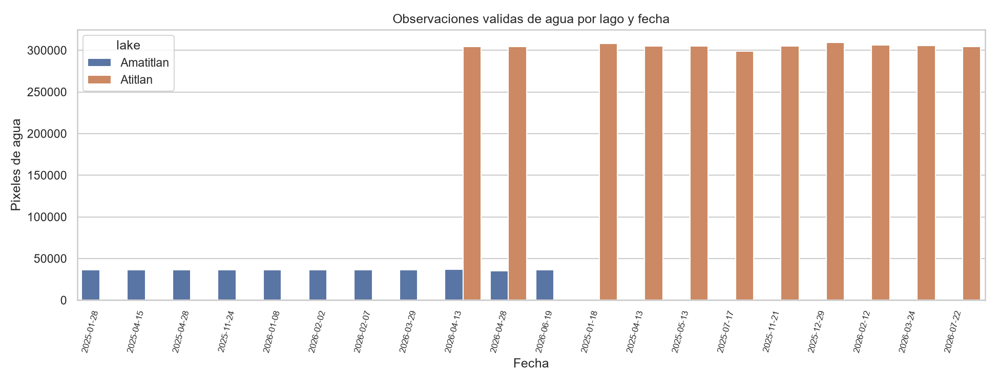

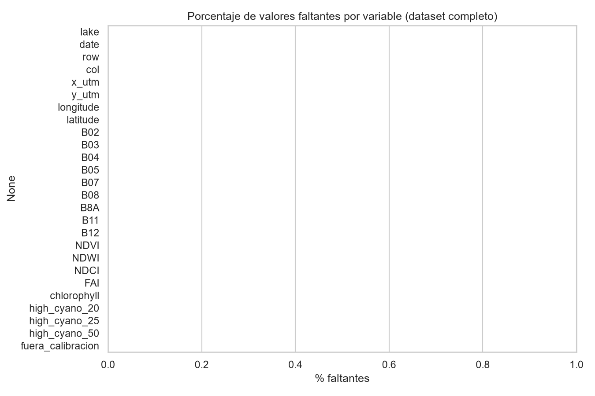

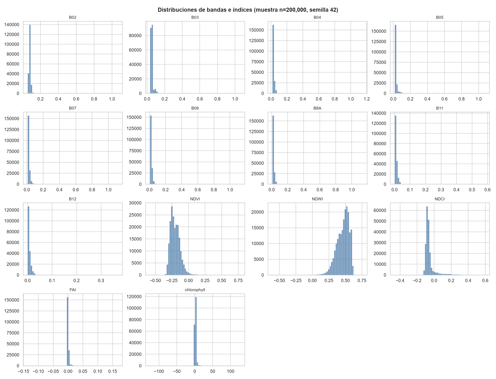

Amatitlán aporta **399,646** observaciones y Atitlán **3,356,864** (Atitlán es un lago mucho más
extenso). No hay valores faltantes en las variables usadas para el modelado.

---

## 4. Variable respuesta: umbral principal 8 µg/L y sensibilidad 20/25/50 (Ejercicio 2)

La respuesta binaria `high_cyano_8` marca clorofila-a estimada ≥ 8 µg/L, la **frontera
mesotrófico → eutrófico** de la clasificación trófica de la OECD (1982). Se eligió por su
significado ambiental, no por conveniencia estadística: de hecho es el umbral que **menos**
favorece el balance de clases entre las cuatro opciones evaluadas.

| Umbral | Positivos Amatitlán | % Amatitlán | Positivos Atitlán | % Atitlán |
|---|---|---|---|---|
| **8 µg/L** | 57,996 | 14.51 % | 2,150 | 0.064 % |
| 20 µg/L | 9,768 | 2.44 % | 64 | 0.0019 % |
| 25 µg/L | 5,181 | 1.30 % | 14 | 0.0004 % |
| 50 µg/L | 604 | 0.15 % | 4 | 0.0001 % |

Con 20, 25 o 50 µg/L, Atitlán queda con tan pocos positivos que ningún modelo podría aprender
nada de esa clase en ese lago. El umbral de 8 µg/L es el único que deja una cantidad
mínimamente razonable de positivos en ambos lagos, lo que hace viables la validación espacial y
la generalización entre lagos de este informe. Los otros tres umbrales quedan documentados como
análisis de sensibilidad, no como alternativas de modelado en este ciclo.

---

## 5. Prevención de fuga de información (Ejercicio 3)

La respuesta se construye a partir de la cadena `B04, B05 → NDCI → clorofila-a → high_cyano_8`.
Por lo tanto, **B04, B05, NDCI, clorofila-a, FAI (que comparte B04) y NDVI (que comparte B04)
están excluidos del conjunto de predictores**, junto con las variables de agrupación
(`lake`, `date`, coordenadas, `spatial_block_1km`) que permitirían memorizar la geografía o la
fecha en vez de aprender la señal espectral.

**Predictores principales (los únicos usados para entrenar):**
`B02, B03, B07, B08, B8A, B11, B12, NDWI`

El código incluye *asserts* que detienen la ejecución si alguna variable prohibida entra al
conjunto `X`.

---

## 6. Modelos e hiperparámetros (Ejercicio 4)

Los tres modelos se ajustaron con `RandomizedSearchCV` (12 configuraciones × 3 folds,
optimizando PR-AUC) sobre una muestra determinista de entrenamiento, semilla 42.

| Modelo | Hiperparámetros seleccionados | PR-AUC en tuning |
|---|---|---|
| Regresión Logística | `l1_ratio=0.0` (equivalente a L2), `C=0.01` | 0.9836 |
| **Random Forest** | `min_samples_leaf=5`, `max_features='sqrt'`, `max_depth=None` | **0.9962** |
| XGBoost | `tree_method='hist'`, ajustado por `RandomizedSearchCV` | — |

> **Nota técnica.** `penalty` de scikit-learn quedó deprecado desde la versión 1.8; se migró a
> `l1_ratio` (0 = L2 pura, 1 = L1 pura), verificado numéricamente como equivalente exacto.

---

## 7. Validación aleatoria 70/30 (Ejercicio 5)

División estratificada por `high_cyano_8`, semilla 42, misma partición de prueba para los tres
modelos.

| Modelo | PR-AUC | Recall (umbral 0.5) | Precision (umbral 0.5) |
|---|---|---|---|
| Regresión Logística | 0.9135 | 0.9947 | 0.4678 |
| Random Forest | 0.9814 | 0.9644 | 0.8550 |
| **XGBoost** | **0.9826** | 0.9885 | 0.7505 |

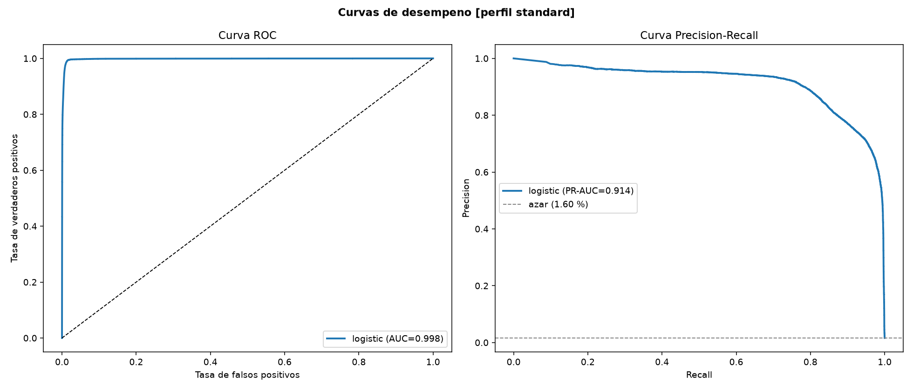

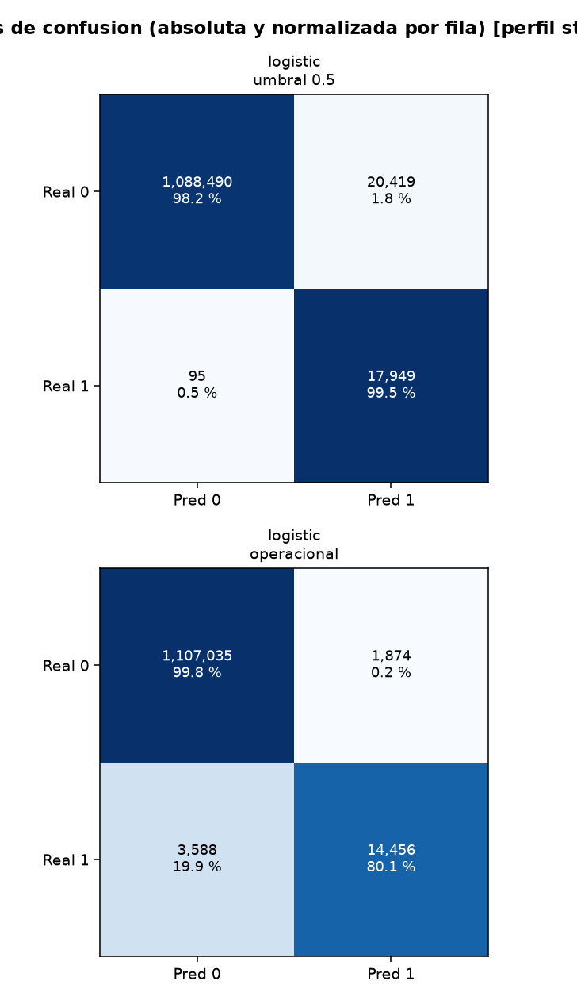

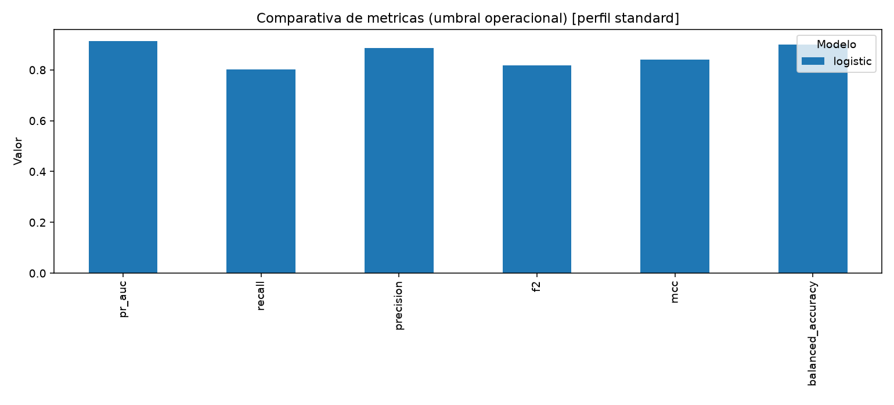

**Esta división es optimista**: mezcla píxeles vecinos del mismo bloque de 1 km —casi
idénticos espectralmente— entre entrenamiento y prueba. No debe leerse como la capacidad real
del modelo de generalizar a zonas nuevas.

---

## 8. Validación espacial por bloques de 1 km (Ejercicio 6)

`StratifiedGroupKFold` con 5 folds sobre `spatial_block_1km` (EPSG:32615, cuadrícula de 1000 m):
**ningún bloque aparece a la vez en entrenamiento y validación**.

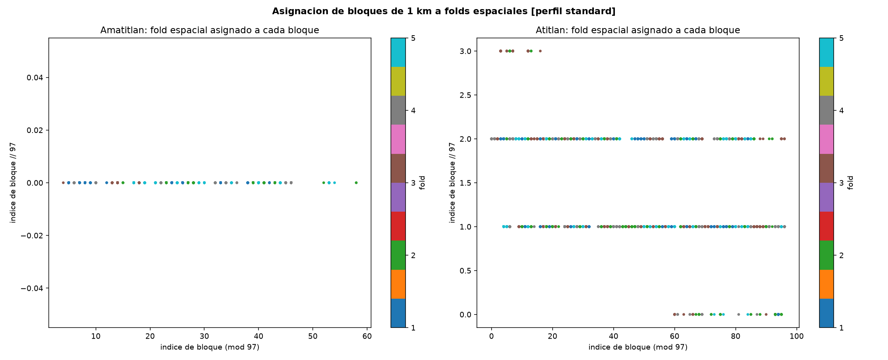

| Modelo | PR-AUC medio | Desviación |
|---|---|---|
| Regresión Logística | 0.9026 | ± 0.0563 |
| **Random Forest** | **0.9758** | ± 0.0128 |
| XGBoost | 0.9757 | ± 0.0150 |

**Random Forest y XGBoost están en empate práctico**: la diferencia (0.0001) es muchísimo menor
que la desviación entre folds (0.0128–0.0150). Random Forest se selecciona por la regla
determinista de mayor PR-AUC medio, **no por superioridad sustantiva**.

## Validación temporal, ventana expansiva

Cada corte entrena únicamente con fechas anteriores y evalúa con la fecha siguiente (ambos
lagos combinados cronológicamente), garantizando que ninguna observación futura entre al
entrenamiento.

| Modelo | PR-AUC medio | Desviación | Mínimo | Máximo |
|---|---|---|---|---|
| Regresión Logística | 0.6429 | ± 0.2839 | 0.1323 | 0.9800 |
| **Random Forest** | **0.7416** | ± 0.2510 | 0.1307 | 0.9879 |
| XGBoost | 0.7042 | ± 0.2571 | 0.1842 | 0.9884 |

La caída frente a la validación espacial (de ~0.976 a ~0.74) y la desviación de ~0.25 muestran
**inestabilidad temporal marcada**: el desempeño depende fuertemente de la fecha evaluada, señal
de que la relación reflectancia↔clorofila cambia con las condiciones atmosféricas y estacionales.

---

## 9. Generalización entre lagos (Ejercicio 7)

Se usó el modelo seleccionado por validación espacial (**Random Forest**), entrenando
exclusivamente con un lago y evaluando en el otro, sin ajustar pesos ni umbral con el lago de
prueba.

| Experimento | Entrena | Evalúa | PR-AUC | Recall operacional | TP | FN |
|---|---|---|---|---|---|---|
| A | Atitlán | Amatitlán | 0.7851 | **0.0401** | 2,324 | 55,672 |
| B | Amatitlán | Atitlán | 0.5081 | **0.1312** | 282 | 1,868 |

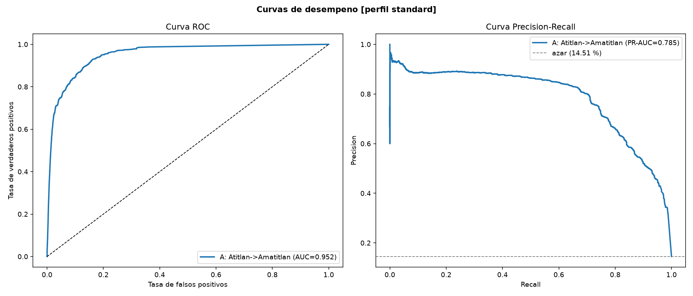

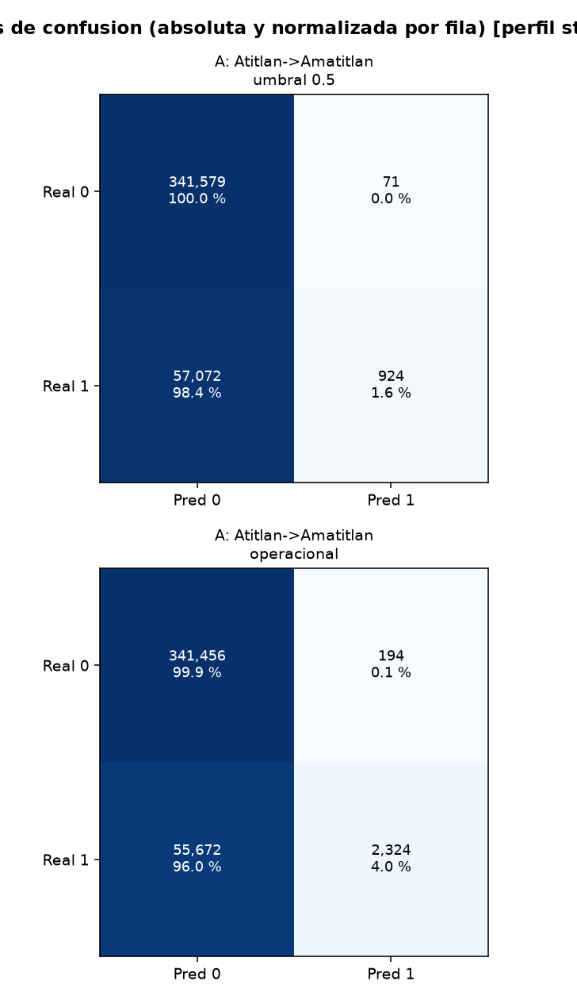

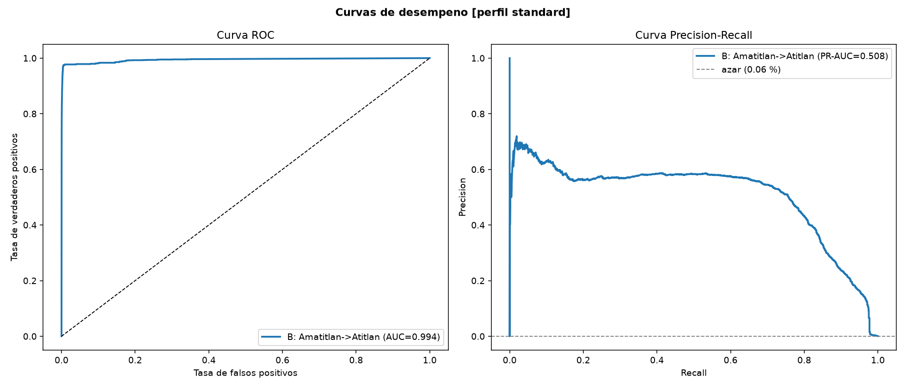

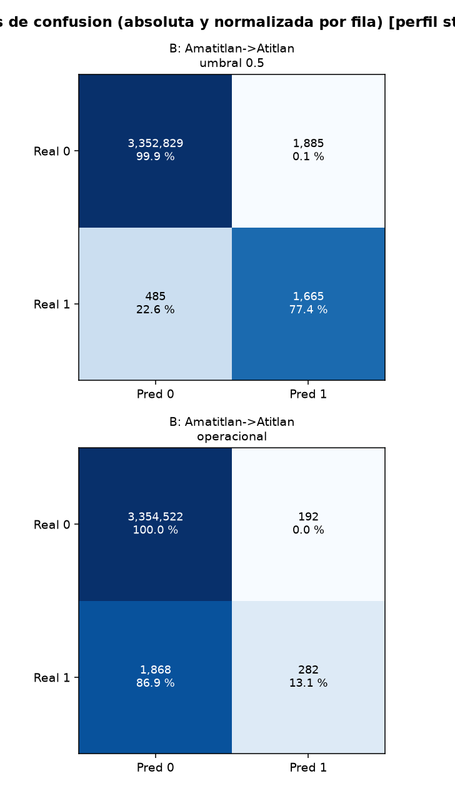

**Un PR-AUC de 0.785 en el Experimento A no equivale a generalización satisfactoria**: bajo el
umbral operacional el recall cae a 4 %, es decir, el modelo deja pasar 55,672 de las zonas
positivas reales. La causa es el cambio de prevalencia entre lagos (0.064 % en Atitlán frente a
14.51 % en Amatitlán, un factor de ~227): el umbral de decisión aprendido en una distribución no
se transfiere a otra con una probabilidad base tan distinta.

---

## 10. Interpretabilidad del Random Forest (Ejercicio 8)

### Importancia nativa (impureza)

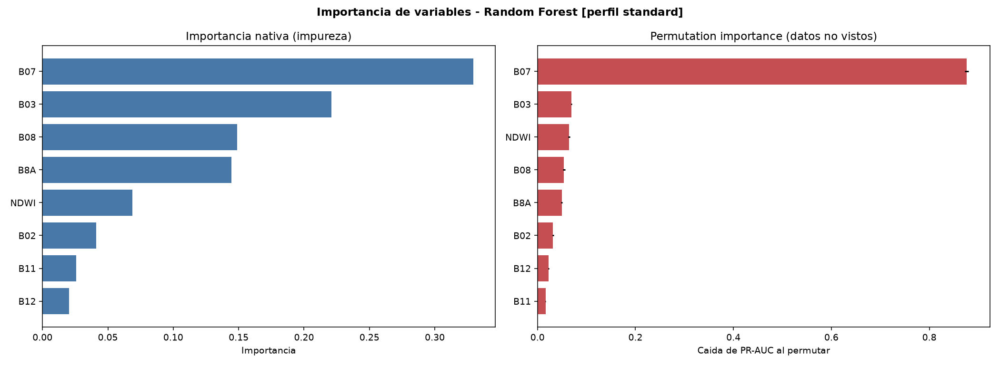

| Variable | Importancia |
|---|---|
| B07 | 0.330 |
| B03 | 0.221 |
| B08 | 0.149 |
| B8A | 0.145 |
| NDWI | 0.069 |
| B02 | 0.041 |
| B11 | 0.026 |
| B12 | 0.020 |

### Permutation importance (sobre 150,000 observaciones NO usadas para ajustar el modelo evaluado)

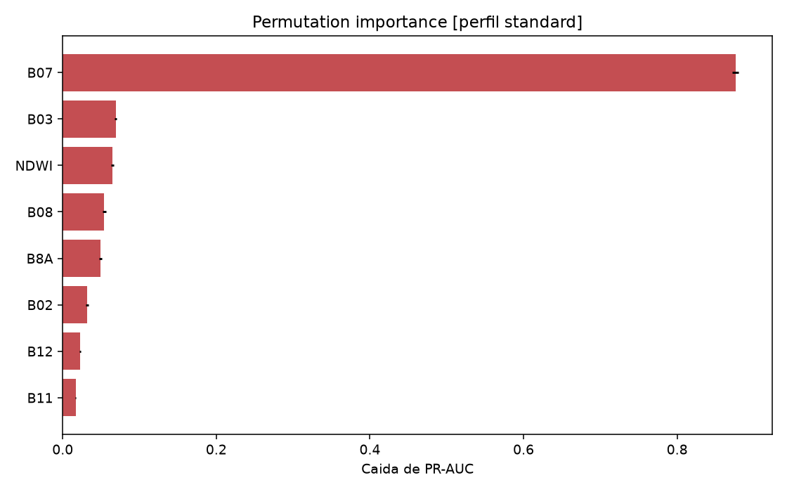

| Variable | Caída de PR-AUC al permutar |
|---|---|
| **B07** | **0.876** |
| B03 | 0.069 |
| NDWI | 0.064 |
| B08 | 0.054 |
| B8A | 0.049 |
| B02 | 0.032 |
| B12 | 0.023 |
| B11 | 0.017 |

### SHAP (`shap.TreeExplainer`, 15,704 observaciones estratificadas por lago × clase)

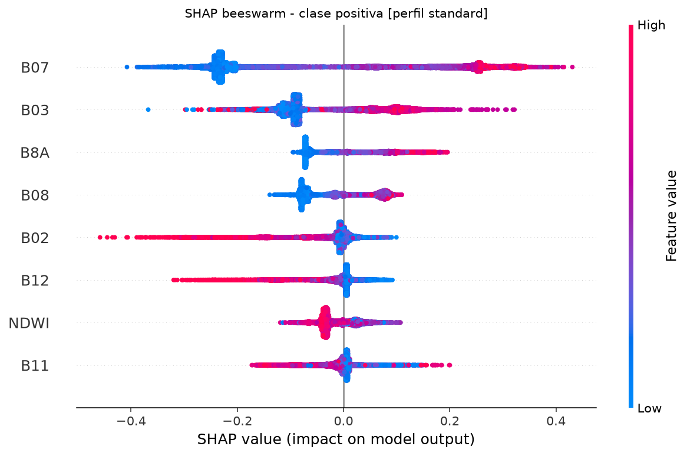

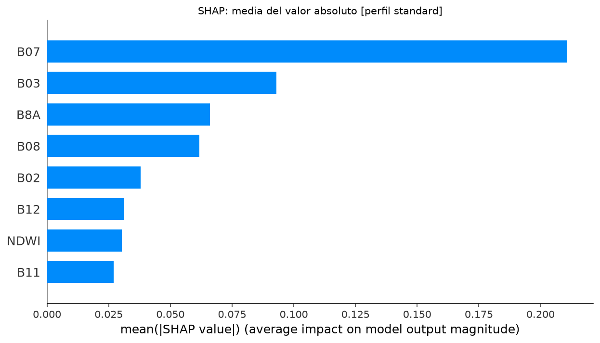

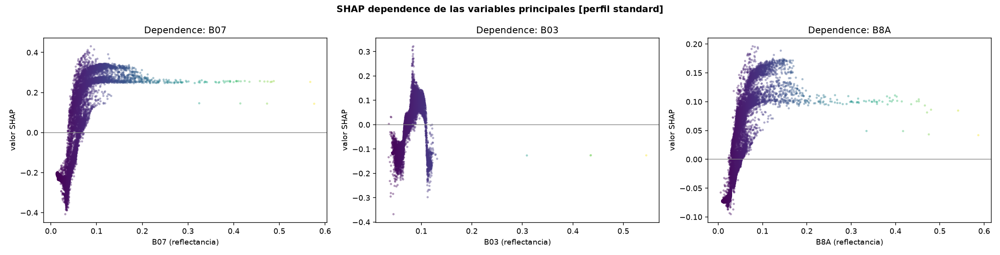

| Variable | SHAP medio (valor absoluto) |
|---|---|
| **B07** | **0.2108** |
| B03 | 0.0930 |
| B8A | 0.0659 |

Las tres técnicas coinciden en que **B07 (borde rojo, 783 nm)** domina la predicción, seguida
por **B03 (verde)**. Esto es coherente con el rol del borde rojo en la detección de biomasa
algal en el algoritmo CyanoLakes.

**Advertencias obligatorias sobre esta interpretación:**

- **SHAP no implica causalidad**: describe la contribución de cada variable a la predicción del
  modelo, no un mecanismo físico verificado.
- Las bandas espectrales están **fuertemente correlacionadas** entre sí; la importancia se
  reparte entre variables redundantes y un valor bajo no significa que una banda sea
  prescindible.
- La respuesta es un **proxy espectral** de clorofila-a, no una medición in situ.
- La muestra SHAP **sobrerrepresenta la clase positiva** (36–39 % frente al 1.6 % poblacional)
  para conservar suficientes ejemplos positivos: las magnitudes son importancia relativa, no
  frecuencia esperada en el lago.

---

## 11. Mapas de probabilidad (Ejercicio 9)

### Mapas descriptivos (modelo ajustado con todo el dataset)

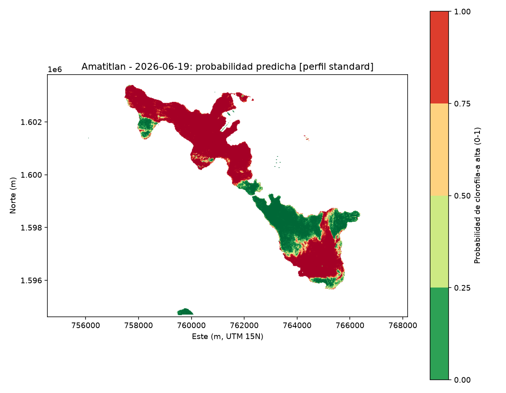

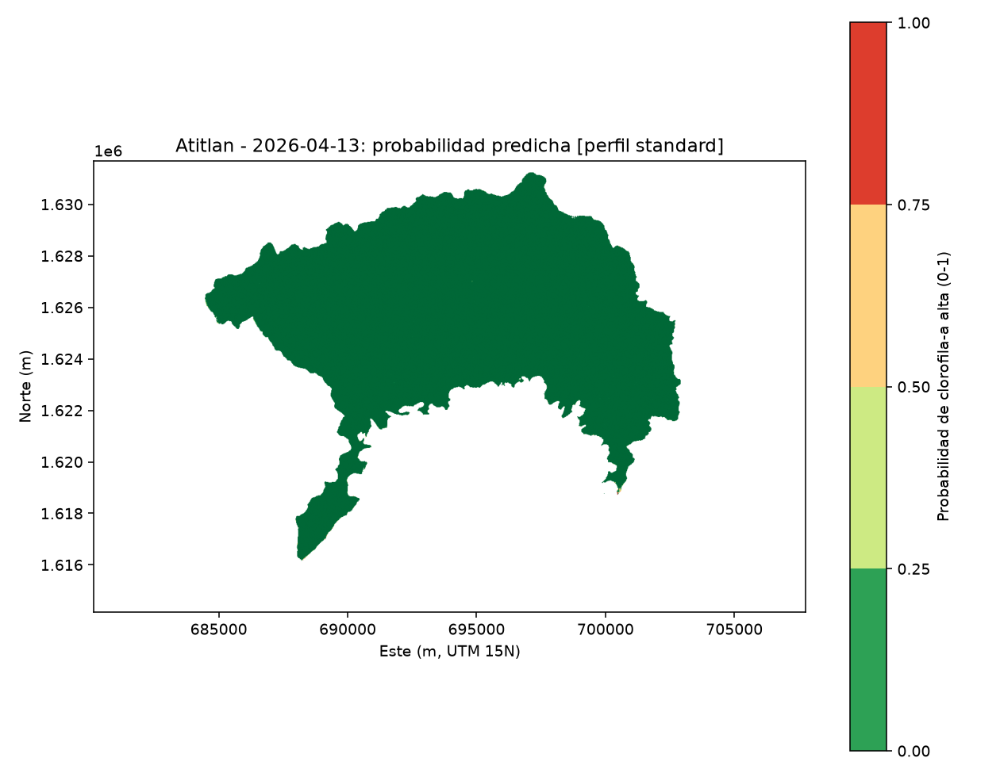

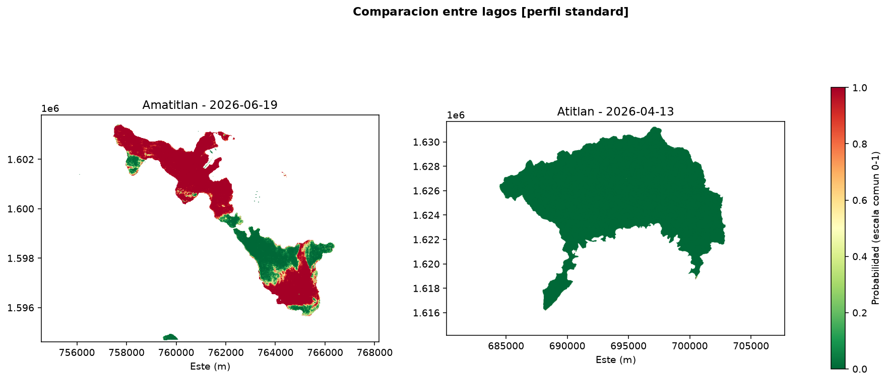

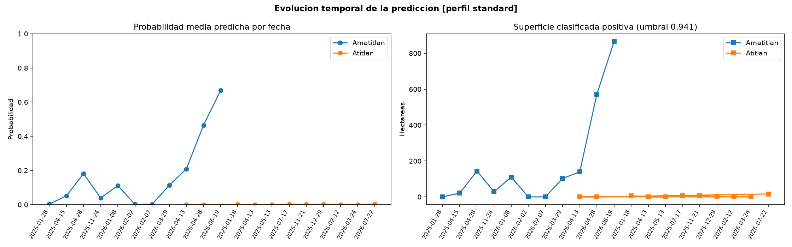

Se generaron **22 GeoTIFF** de probabilidad (uno por combinación lago-fecha), en float32,
EPSG:32615, con NoData, comprimidos con LZW y con tags de lago, fecha, modelo y umbral. Las
fechas críticas (Amatitlán 2026-06-19, Atitlán 2026-04-13) se confirmaron desde los CSV de la
Parte 1.

> **Advertencia metodológica central.** Estos mapas se generan con un Random Forest **ajustado
> con el 100 % del dataset** para producir una capa descriptiva de despliegue. **No son una
> validación no sesgada**: el modelo ya vio esas observaciones durante el ajuste. La evaluación
> honesta del desempeño espacial es la sección siguiente.

### Errores espaciales out-of-fold (evaluación no sesgada)

Cada una de las 3,756,510 observaciones se predijo **exactamente una vez**, con los mismos
cinco folds espaciales del Ejercicio 6 (cero bloques compartidos, hiperparámetros fijos, sin
ajuste adicional).

| Métrica | Valor |
|---|---|
| PR-AUC OOF | **0.9779** |
| Recall (umbral operacional) | 0.7774 |
| Precision (umbral operacional) | 0.9832 |
| Verdaderos positivos (TP) | 46,760 |
| **Falsos negativos (FN)** | **13,386** (535.4 ha sin aviso) |
| Falsos positivos (FP) | 797 (31.9 ha de inspección innecesaria) |
| Verdaderos negativos (TN) | 3,695,567 |

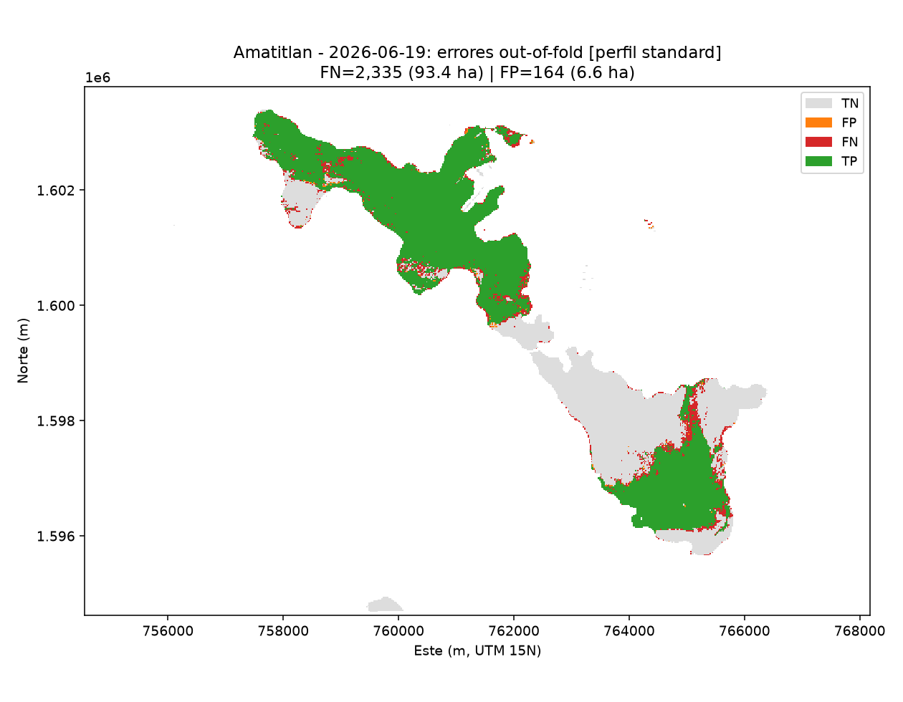

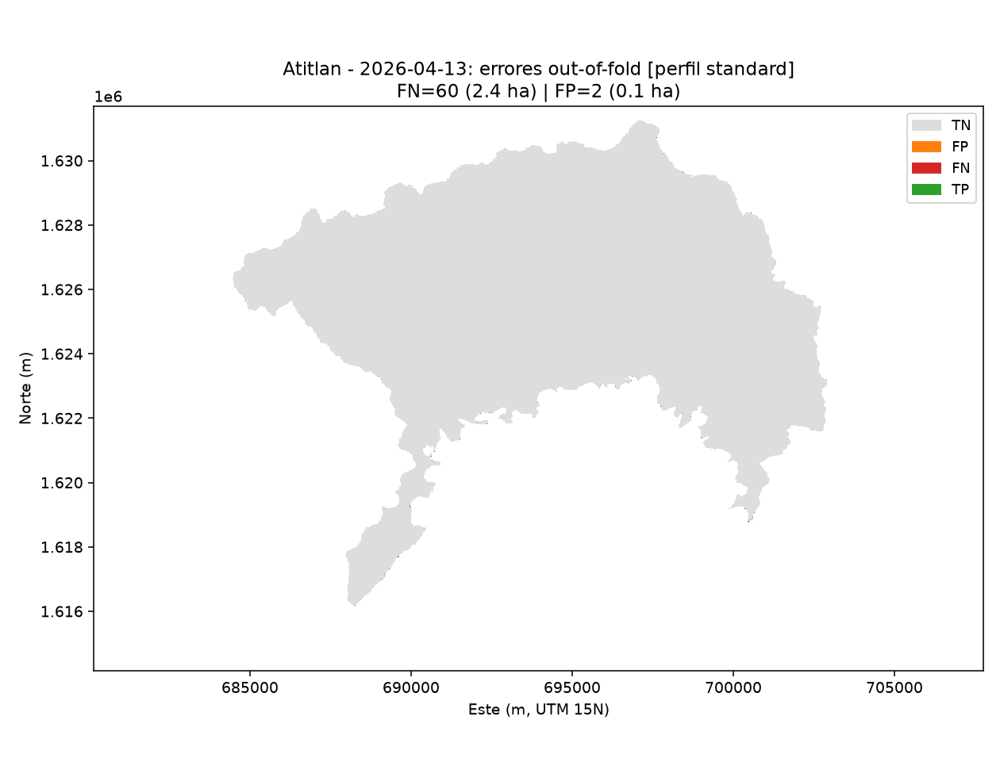

El **falso negativo es el error ambientalmente más grave**: una zona con floración alta que no
recibe aviso. Por eso la métrica prioritaria es el Recall, complementada con F2 (que pondera el
Recall por encima de la Precision).

---

## 12. Conclusiones (Ejercicio 10)

1. El **split aleatorio 70/30 es optimista**: mezcla píxeles vecinos del mismo bloque de 1 km,
   casi idénticos entre sí.
2. **Random Forest y XGBoost están en empate práctico** bajo validación espacial (diferencia
   0.0001, menor que la desviación entre folds).
3. Existe **inestabilidad temporal marcada**: el desempeño cae de ~0.976 (espacial) a ~0.74
   (temporal), con desviación de ~0.25 entre fechas.
4. La **transferencia entre lagos no es satisfactoria**: con umbral fijo, el recall operacional
   se desploma en ambas direcciones (4 % y 13 %).
5. El modelo sirve como **apoyo de cribado** dentro del dominio observado —estos dos lagos,
   estas fechas, este algoritmo de referencia—, no como sistema de alerta universal.
6. **No sustituye el monitoreo in situ**: no confirma presencia de cianobacterias ni toxicidad.
7. **No demuestra transferencia robusta** a otros lagos ni a fechas futuras fuera del rango
   observado.

---

## 13. Limitaciones

- La respuesta es un **proxy espectral** de clorofila-a, no una medición de cianobacterias ni
  de toxinas.
- **No hubo validación in situ** en ninguna fase del laboratorio.
- El algoritmo CyanoLakes reporta **MAPE 42.3 % y RMSE relativo 95.8 %**, calibrado para
  *Microcystis aeruginosa* sobre datos simulados.
- Dominio de calibración del NDCI: 1–60 µg/L; una parte importante de los píxeles de Atitlán
  queda por debajo de ese rango.
- Atitlán presenta **clorofila estimada negativa** en una fracción de sus píxeles: valores sin
  sentido físico, conservados para trazabilidad, no forzados a cero.
- La colección `SENTINEL2_L1C` **no expone máscara de nubes por píxel** (sin CLM, CLP,
  dataMask, SCL ni QA60).
- Solo **22 escenas** (11 fechas por lago): insuficiente para afirmar tendencias interanuales.
- **Desbalance 1:61** y fuerte concentración de los positivos (37.7 % en 5 bloques, 87.6 % en 5
  fechas de la Parte 1).
- Los mapas de probabilidad descriptivos son *in-sample*; la evaluación no sesgada es la
  out-of-fold.

---

## 14. Recomendaciones

1. **Validar con muestreo de campo** al menos las fechas y bloques donde el modelo predice alta
   probabilidad, antes de usarlo para decisiones operativas.
2. **No usar el modelo entrenado en un lago para predecir en el otro** sin recalibrar el umbral
   con datos locales.
3. Priorizar la **validación espacial y temporal** sobre el split aleatorio al reportar
   desempeño esperado.
4. Ampliar la serie temporal en futuras temporadas para reducir la inestabilidad observada entre
   fechas.
5. Investigar una máscara de nubes por píxel (por ejemplo, migrando a una colección con SCL) para
   reducir ruido en las bandas de entrada.
6. Usar los mapas de error out-of-fold —no los descriptivos— para cualquier estimación de
   cobertura o de área afectada.

---

> **Alcance del sistema.** Herramienta de **cribado** para priorizar dónde y cuándo muestrear,
> dentro del dominio observado (estos lagos, estas fechas, este algoritmo). No es un diagnóstico
> de toxicidad ni un sustituto del monitoreo in situ.
